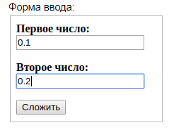
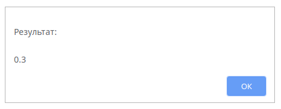

Cтраница с двумя полями ввода и кнопкой. По нажатию кнопки выводится значение суммы введенных чисел. Значения по умолчанию для полей: 0.1 и 0.2. 
* Пример:
	ввод: 0.1, 0.2
 	вывод: 0.3
  

Вывод результата
